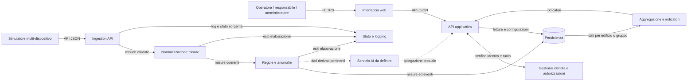

# Architettura v1 — Energy Monitor / AlpEnergia Servizi S.p.A.

|              |                                                                                                         |
| ------------ | ------------------------------------------------------------------------------------------------------- |
| **Team**     | TEnergy: Alessandro Passerini, Riccardo Mascotto, Giacomo Grattarola, Emanuele Rossi, Sebastiano Dalpez |
| **Cliente**  | AlpEnergia Servizi S.p.A.                                                                               |
| **Data**     | 30/09/2026                                                                                              |
| **Versione** | v1 — provvisoria per definizione, la confronterete con la v2 a dicembre                                 |

_Proposta logica v1, agnostica rispetto allo stack. Le scelte tecnologiche
saranno motivate in una successiva decisione del team; il brief non impone
linguaggio, framework o database. Le rotte e i dettagli non specificati dal
cliente sono proposte da validare, non requisiti già concordati._

## Componenti

| Componente                         | Risponde di                                                                                                                                  | Non risponde di                                                             |
| ---------------------------------- | -------------------------------------------------------------------------------------------------------------------------------------------- | --------------------------------------------------------------------------- |
| Simulatore / adattatori sorgente   | Generano o ricevono dati e li inviano nel formato concordato; ogni sorgente ha configurazione e stato propri.                                | Persistenza centrale, visualizzazione e autorizzazioni utente.              |
| Ingestion API                      | Autentica la sorgente e valida la **forma** del payload (campi, tipi, riferimenti), poi consegna le misure.                                  | Normalizzazione semantica, dashboard, aggregazioni e configurazione soglie. |
| Normalizzazione misure             | Uniforma formati e unità e rende le misure coerenti e confrontabili.                                                                         | Decidere superamenti di soglia e presentazione all'utente.                  |
| Motore regole e anomalie           | Valuta le soglie attive e crea gli eventi di anomalia.                                                                                       | Rendering UI e modifica dei dati originali.                                 |
| Aggregazione e indicatori          | Calcola gli indicatori aggregati per edificio o gruppo richiesti dalla dashboard.                                                            | Acquisizione, regole di soglia e layout della dashboard.                    |
| Persistenza                        | Conserva misure, anagrafiche, soglie, anomalie, audit e stato dei dispositivi.                                                               | Generazione dati o presentazione all'utente.                                |
| API applicativa                    | Applica autenticazione/autorizzazione ed espone consultazione (misure, aggregati, anomalie) e configurazione protetta (soglie, anagrafiche). | Acquisizione diretta dai dispositivi e layout della dashboard.              |
| Interfaccia web                    | Presenta dashboard, filtri, storico, anomalie e funzioni consentite al ruolo.                                                                | Regole di business affidabili o accesso diretto al database.                |
| Gestione identità e autorizzazioni | Verifica identità e ruolo, limita le operazioni consentite e gestisce utenti e ruoli.                                                        | Elaborazione delle misure.                                                  |
| Stato e logging                    | Registra esiti di ricezione/elaborazione e distingue salute applicativa e raggiungibilità delle sorgenti.                                    | Sostituire il monitoraggio infrastrutturale dell'ambiente di deployment.    |
| Servizio AI (opzionale)            | Produce una breve spiegazione usando dati derivati pertinenti, se abilitato.                                                                 | Modificare misure, soglie o eventi e prendere decisioni automatiche.        |

## Diagramma

Le frecce indicano il flusso dei dati o la dipendenza; le tratteggiate
indicano la funzionalità AI prevista, la cui integrazione è ancora da definire.



Il simulatore è separato dal nucleo applicativo e può essere sostituito da un
adattatore di telelettura. L'indisponibilità temporanea di una sorgente non
deve impedire la consultazione delle misure già registrate. Le sorgenti hanno
configurazione e stato distinti. L'uso di code o broker non è deciso: dipende
da frequenze e volumi, ancora da chiarire.

### Interfaccia dati proposta

Il payload JSON proposto include timestamp e unità. Le rotte seguenti sono
una proposta REST v1, non definite dal cliente. Autenticazione delle sorgenti,
gestione di duplicati e dati fuori ordine, paginazione e frequenza di invio
sono decisioni ancora aperte.

| Metodo e rotta                                                   | Scopo                                                                                       | Accesso proposto                                     |
| ---------------------------------------------------------------- | ------------------------------------------------------------------------------------------- | ---------------------------------------------------- |
| `POST /api/v1/measurements`                                      | Acquisisce un batch di misure per un dispositivo.                                           | Sorgente; autenticazione da definire.                |
| `GET /api/v1/measurements?buildingId=&deviceId=&type=&from=&to=` | Consulta lo storico filtrabile per edificio, dispositivo, grandezza e periodo.              | Utenti autorizzati.                                  |
| `GET /api/v1/devices/{deviceId}/measurements/latest`             | Restituisce le misure più recenti del dispositivo.                                          | Utenti autorizzati.                                  |
| `GET /api/v1/dashboard?buildingId=&groupId=&from=&to=`           | Restituisce indicatori aggregati per edificio o gruppo di dispositivi.                      | Responsabile; accesso degli altri ruoli da definire. |
| `POST /api/v1/buildings`                                         | Registra un edificio.                                                                       | Amministratore.                                      |
| `POST /api/v1/devices`                                           | Registra un dispositivo e lo associa a un edificio.                                         | Amministratore.                                      |
| `GET /api/v1/anomalies?buildingId=&deviceId=&status=`            | Consulta le anomalie filtrate.                                                              | Utenti autorizzati.                                  |
| `POST /api/v1/anomalies/{anomalyId}/acknowledgement`             | Registra la presa visione dell'utente autenticato.                                          | Utenti autorizzati.                                  |
| `PUT /api/v1/thresholds/{thresholdId}`                           | Crea o aggiorna una soglia e registra l'audit.                                              | Responsabile o amministratore.                       |
| `GET /api/v1/health`                                             | Restituisce lo stato dei componenti applicativi, distinguendolo dallo stato delle sorgenti. | Accesso operativo da definire; non espone segreti.   |

Le risposte di acquisizione distinguono richiesta accettata e input non
valido; gli errori non devono essere presentati come misure persistite.
L'API di consultazione restituisce timestamp e unità insieme ai valori.

```json
{
  "deviceId": "meter-001",
  "measuredAt": "2026-09-30T10:15:00Z",
  "measurements": [
    { "type": "energy_consumption", "value": 12.4, "unit": "kWh" },
    { "type": "power", "value": 3.2, "unit": "kW" },
    { "type": "temperature", "value": 21.8, "unit": "Cel" },
    { "type": "humidity", "value": 58, "unit": "%" }
  ]
}
```

L'associazione tra dispositivo ed edificio è gestita nell'anagrafica; il
payload non la ripete. Tipi e unità sono esemplificativi e vanno consolidati
nel contratto API.

## Dipendenze

| Componente              | Dipende da                                                     | Se si ferma                                                                                                             |
| ----------------------- | -------------------------------------------------------------- | ----------------------------------------------------------------------------------------------------------------------- |
| Simulatore / adattatori | Configurazione e Ingestion API                                 | La sorgente risulta non aggiornata; altre sorgenti e consultazione proseguono.                                          |
| Ingestion API           | Autenticazione macchina, validazione, persistenza/elaborazione | La sorgente riceve un errore registrabile; le API di consultazione servono i dati salvati.                              |
| Elaborazione e regole   | Misure validate e regole persistite                            | Le anomalie possono essere ritardate; l'esito resta visibile. Il recupero va definito.                                  |
| API di consultazione    | Persistenza e gestione identità                                | Dashboard non disponibile; acquisizione resta indipendente dall'interfaccia.                                            |
| Interfaccia web         | API di consultazione                                           | L'utente non vede aggiornamenti; acquisizione e persistenza restano indipendenti.                                       |
| Persistenza             | Servizio database scelto                                       | Letture/scritture possono fallire; il sistema segnala stato degradato e non dichiara salvata una misura non persistita. |
| Servizio AI             | Configurazione e fornitore AI, se esterno                      | La spiegazione non è disponibile; dashboard, soglie e anomalie continuano.                                              |
| Stato e logging         | Raccolta log e controlli salute                                | Si perde visibilità diagnostica; la distinzione tra sorgente e piattaforma resta requisito.                             |

## Fuori dal perimetro

- Sensori e dispositivi fisici: non richiesti per la prima versione.
- Integrazione con sistemi reali di telelettura: futura, non necessaria per la demo.
- Scelta e gestione dell'infrastruttura di produzione: non specificata dal brief.
- Decisioni automatiche basate sulla spiegazione AI: escluse.
