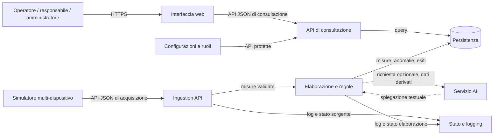

# Architettura v1 — Energy Monitor / AlpEnergia Servizi S.p.A.

|              |                                                                                                         |
| ------------ | ------------------------------------------------------------------------------------------------------- |
| **Team**     | TEnergy: Alessandro Passerini, Riccardo Mascotto, Giacomo Grattarola, Emanuele Rossi, Sebastiano Dalpez |
| **Cliente**  | AlpEnergia Servizi S.p.A.                                                                               |
| **Data**     | 30/09/2026                                                                                              |
| **Versione** | v1 — provvisoria per definizione, la confronterete con la v2 a dicembre                                 |

_Proposta logica v1, agnostica rispetto allo stack. Le scelte tecnologiche
saranno motivate in una successiva decisione del team; il brief non impone
linguaggio, framework o database._

## Componenti

_Un componente è un pezzo che potreste rilasciare, sostituire o spegnere da
solo. Per ciascuno: una riga di responsabilità, una di non-responsabilità. Se
per descriverne uno vi serve una "e" tra due responsabilità diverse, sono
probabilmente due componenti._

| Componente                         | Risponde di                                                                                                   | Non risponde di                                                          |
| ---------------------------------- | ------------------------------------------------------------------------------------------------------------- | ------------------------------------------------------------------------ |
| Simulatore / adattatori sorgente   | Generano o ricevono dati e li inviano nel formato concordato; ogni sorgente ha configurazione e stato propri. | Persistenza centrale, visualizzazione e autorizzazioni utente.           |
| Ingestion API                      | Autentica la sorgente, valida il payload e consegna le misure per l'elaborazione.                             | Dashboard, aggregazioni e configurazione soglie.                         |
| Elaborazione e regole              | Valida/normalizza le misure, valuta soglie e crea eventi di anomalia.                                         | Rendering UI e modifica dei dati originali.                              |
| Persistenza                        | Conserva misure, anagrafiche, soglie, anomalie, audit e stato dei dispositivi.                                | Generazione dati o presentazione all'utente.                             |
| API di consultazione               | Applica autenticazione/autorizzazione e restituisce misure, aggregati e anomalie.                             | Acquisizione diretta dai dispositivi e layout della dashboard.           |
| Interfaccia web                    | Presenta dashboard, filtri, storico, anomalie e funzioni consentite al ruolo.                                 | Regole di business affidabili o accesso diretto al database.             |
| Gestione identità e autorizzazioni | Verifica identità e ruolo e limita le operazioni consentite.                                                  | Elaborazione delle misure.                                               |
| Stato e logging                    | Registra esiti di ricezione/elaborazione e distingue salute applicativa e raggiungibilità delle sorgenti.     | Sostituire il monitoraggio infrastrutturale dell'ambiente di deployment. |
| Servizio AI (opzionale)            | Produce una breve spiegazione usando dati derivati pertinenti, se abilitato.                                  | Modificare misure, soglie o eventi e prendere decisioni automatiche.     |

## Diagramma

_Scatole = componenti, frecce = "chiama"/"dipende da" con sopra cosa passa
(es. HTTPS/JSON, SQL, file). Segnate cosa è dentro il vostro perimetro e cosa
è fuori (servizi di terzi, sistemi del cliente). Ciò che è previsto ma non
ancora realizzato si disegna tratteggiato. Va bene un blocco Mermaid come
questo, un disegno fotografato, o qualunque notazione capiate a colpo
d'occhio come team — l'importante è che le frecce siano etichettate._



Il simulatore è separato dal nucleo applicativo e può essere sostituito da un
adattatore di telelettura. La persistenza separa acquisizione e consultazione:
un errore di acquisizione non rende indisponibili i dati già registrati. Le
sorgenti hanno configurazione ed esito di salute distinti; l'uso di code o
broker va deciso in base a frequenze e volumi da chiarire.

### Interfaccia dati proposta

Payload JSON iniziale, con timestamp esplicito e unità dichiarata. Frequenza,
Payload JSON iniziale, con timestamp esplicito e unità dichiarata. Le rotte
seguenti costituiscono una proposta REST v1; autenticazione macchina,
duplicati, paginazione e dati fuori ordine sono ancora da confermare in
`domande-cliente.md`.

| Metodo e rotta                                                   | Scopo                                              | Accesso                                                 |
| ---------------------------------------------------------------- | -------------------------------------------------- | ------------------------------------------------------- |
| `POST /api/v1/measurements`                                      | Acquisisce un batch di misure per un dispositivo.  | Sorgente autenticata; restituisce esito di validazione. |
| `GET /api/v1/measurements?buildingId=&deviceId=&type=&from=&to=` | Consulta lo storico filtrabile.                    | Operatore, responsabile, amministratore.                |
| `GET /api/v1/devices/{deviceId}/measurements/latest`             | Restituisce le misure più recenti del dispositivo. | Operatore, responsabile, amministratore.                |
| `GET /api/v1/anomalies?buildingId=&deviceId=&status=`            | Consulta le anomalie filtrate.                     | Operatore, responsabile, amministratore.                |
| `POST /api/v1/anomalies/{anomalyId}/acknowledgement`             | Registra la presa visione dell'utente autenticato. | Operatore, responsabile, amministratore.                |
| `PUT /api/v1/thresholds/{thresholdId}`                           | Crea o aggiorna una soglia e registra l'audit.     | Responsabile o amministratore.                          |
| `GET /api/v1/health`                                             | Restituisce lo stato dei componenti applicativi.   | Accesso operativo da definire; non espone segreti.      |

Le risposte di acquisizione distinguono richiesta accettata e input non
valido; gli errori non devono essere presentati come misure persistite.
L'API di consultazione restituisce timestamp e unità insieme ai valori.

```json
{
  "deviceId": "meter-001",
  "measuredAt": "2026-09-30T10:15:00Z",
  "measurements": [
    { "type": "energy_consumption", "value": 12.4, "unit": "kWh" },
    { "type": "temperature", "value": 21.8, "unit": "Cel" }
  ]
}
```

## Dipendenze

_Elenco esplicito: chi dipende da chi, e cosa succede se il componente da cui
si dipende si ferma o risponde male._

| Componente              | Dipende da                                                     | Se si ferma                                                                                                             |
| ----------------------- | -------------------------------------------------------------- | ----------------------------------------------------------------------------------------------------------------------- |
| Simulatore / adattatori | Configurazione e Ingestion API                                 | La sorgente risulta non aggiornata; altre sorgenti e consultazione proseguono.                                          |
| Ingestion API           | Autenticazione macchina, validazione, persistenza/elaborazione | La sorgente riceve un errore registrabile; le API di consultazione servono i dati salvati.                              |
| Elaborazione e regole   | Misure validate e regole persistite                            | Le anomalie possono essere ritardate; l'esito resta visibile. Il recupero va definito.                                  |
| API di consultazione    | Persistenza e gestione identità                                | Dashboard non disponibile; acquisizione resta indipendente dall'interfaccia.                                            |
| Interfaccia web         | API di consultazione                                           | L'utente non vede aggiornamenti; acquisizione e persistenza restano indipendenti.                                       |
| Persistenza             | Servizio database scelto                                       | Letture/scritture possono fallire; il sistema segnala stato degradato e non dichiara salvata una misura non persistita. |
| Servizio AI             | Configurazione e fornitore AI, se esterno                      | La spiegazione non è disponibile; dashboard, soglie e anomalie continuano.                                              |
| Stato e logging         | Raccolta log e controlli salute                                | Si perde visibilità diagnostica; la distinzione tra sorgente e piattaforma resta requisito.                             |

## Fuori dal perimetro

_Cosa esiste ma non lo costruite voi: sistemi del cliente, servizi esterni,
integrazioni future dichiarate nella richiesta._

- Sensori e dispositivi fisici: non richiesti per la prima versione.
- Integrazione con sistemi reali di telelettura: futura, non necessaria per la demo.
- Scelta e gestione dell'infrastruttura di produzione: non specificata dal brief.
- Decisioni automatiche basate sulla spiegazione AI: escluse.
